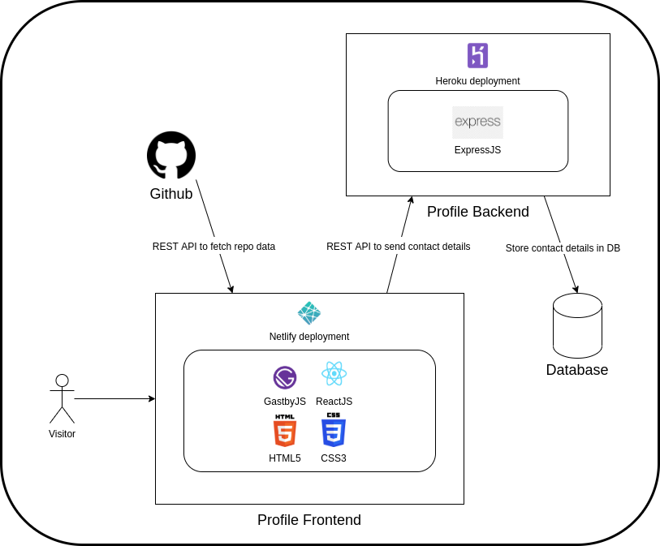

## Hey 👋, I'm [Tanishq Agarwal!](https://github.com/tanishq-agarwal):innocent:

 
 <a href="https://tanishq-agarwal.netlify.app/" align="left" > My Qprofile : tanishq-agarwal.netlify.app </a> 
 
 

### Background

Let’s understand what a Full Stack Web Application means. Web application development has two main components that make it work.

  1.  The <b>Frontend</b>  is where the user views and interacts with the web application, usually from a browser on a laptop or a mobile. E.g. [www.zomato.com](https://www.zomato.com/akola?city_id=11434) or <a href= "https://twitter.com/">www.twitter.com</a>

  2.  The <b>Backend</b> is where the intelligence of the application comes in. It stores and manipulates data and generates the content that will be sent to the Frontend, to be displayed. These two components talk to each other for requests and responses.

A Full Stack Web developer is one who can build both the Frontend (a.k.a Client) and the Backend (a.k.a Server) of a web application. The interaction between the Frontend and Backend (e.g. REST API) and data storage (e.g. MongoDB or MySQL), if needed, also needs to be built.

There are a number of different components/frameworks that go into building a full stack application and these are the ones I have used in my  project:

  -  **HTML (Frontend)** - HTML is the standard language used to create webpage content.

  -  **CSS (Frontend)** - CSS describes how HTML elements should be displayed on the page.

  -  **JavaScript (Frontend)** - JavaScript is a programming language which can do data manipulation and update the HTML and CSS of a page.

  -  **React (Frontend)** - React is a JavaScript library for building user interfaces or UI components.

  -  **Gatsby (Frontend)** - Gatsby is a React based framework to generate static websites which are fast.

  -  **Netlify (Frontend)** - Netlify is a service that we’ll use to deploy our Frontend publicly.

  -  **NodeJS (Backend)** - Node.js is a JavaScript runtime environment which can be used to run your Backend server. Note that it can also be used to run your Frontend as well, but here we’ll use it to run the Backend only.

  -  **Express (Backend)** - Express is a Node.js web application framework that provides a robust set of features for web and mobile applications.

  -  **Npm** - npm is a package manager for Node.js packages, or modules

  -  **Heroku (Backend)** - Heroku is a service we’ll use to deploy our Backend publicly

  -  **REST API (Interface between Frontend and Backend)** - It is a standard request/response format that allows two components or applications to talk to each other.

  -  **Github** - It is a platform where you can host your projects and code. It provides version control and lets you collaborate with others on projects.

### QProfile Architecture

Take a look at the overall architecture of the QProfile application below. It is a full stack application including the Frontend and Backend components.

The Frontend is built using HTML5, CSS, ReactJS and Gatsby and is deployed to Netlify. It interacts with the github site to fetch the profile owner’s projects using REST API.

The Backend is built using ExpressJS and is deployed to Heroku. It interacts with the Frontend using REST API and stores the contact details sent from the Frontend in a Database.

 

### Frontend Code Overview

Under the QProfile folder in your workspace, open up the `profile-frontend` folder, which contains the Frontend code for the application.You will see many directories here. All of the source code is contained under the `src` folder and the tests under the `tests` folder

  1.  `src/assets` - contains all static assets (icons, illustrations, thumbnails) required for your project

  2.  `src/components` - contains all the React components (building blocks) for your profile website

  3.  `src/data` - includes a file `config.js` that dynamically picks up data to show on the webpage

  4.  `src/hooks` and `src/providers` - responsible for providing light and dark themes to your profile

  5.  `src/pages` - lists all the pages in your profile. In this project, there are only two pages - the index page containing your profile data and the 404 page for any other non existent route

Other key files include

  1.  `package.json` - this file contains the dependencies for the project

### Backend Code Overview

Under the QProfile folder in your workspac, open up the `profile-backend` folder, which contains the Backend code for the application.

  1.  `index.js` - contains all the APIs exposed by your backend

  2.  `entries.js` - contains the logic required for fetching and storing entries

